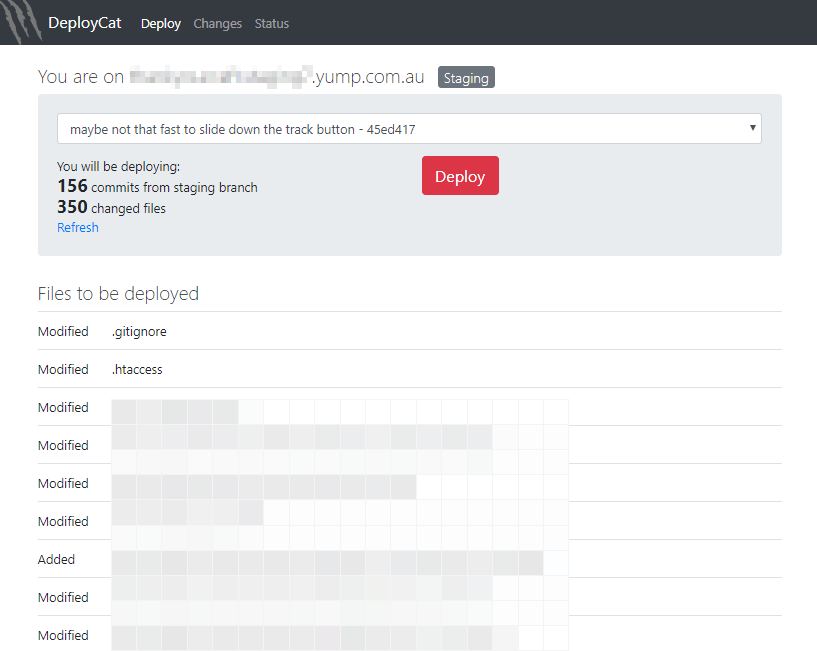

# DeployCat
Super-easy single-click website deployments. Requires PHP &amp; git.

Version 0.1.3. Public alpha. 

## Server Requirements

* PHP 5.6+ or 7
* git 
* The necessary permissions for PHP to run git and modify files (cPanel usually permits this by default)

## Security

Access to this tool is currently only controlled by an IP address whitelist. You can use this to give access to as many IP addresses as needed for your team. Future versions will support username/password logins.

It's highly important that you prevent anything inside your `.git` folder from being accessible over the web, otherwise it can leak your source code. Some servers automatically block files and folders beginning with a dot, but if needed you can otherwise do this with some `.htaccess` rules. In future versions we will support placing your `.git` folder outside of `public_html`.

## Installation

At the moment, installation is pretty manual and requires using an SSH shell. We will aim to improve this in future so that SSH is not required, but for now it is.

Steps:

1. Ensure your web server meets the necessary requirements (see above)

2. [Download a copy of DeployCat](https://github.com/SimonEast/DeployCat/archive/master.zip). (We may add composer support in a future version.)

3. Extract the ZIP, then upload all the files to a publicly-accessible folder on your web server. You can use FTP, wget or cPanel file manager of your choice.

4. SSH into server

5. Ensure git has been setup with a username/email

       git config --global user.email "devs@yump.com.au"
       git config --global user.name "Web Server"

6. Ensure server has its own SSH key setup. If you need to create a key, type:

       ssh-keygen -t rsa -C "devs@yump.com.au"

7. Display the key by typing this: (then copy to clipboard)

       cat ~/.ssh/id_rsa.pub

8. Give the *public* SSH key read-only-access to your repository. In Github this is often referred to as a "Deployment key".

    In BitBucket, click *[Your Repo] > Settings > Access keys*, then add the SSH key copied from the step above. Label it as "Production Server" or "Staging Server".  

9. On server, init git repo:

       cd ~/public_html
       git init
       git remote add origin git@bitbucket.org:XXXXX/XXXXX.git
       git fetch

10. To check whether the existing work copy (if there is one) matches the relevant branch (*this is safe and won't change the working copy*). Here we're using the `master` branch, but change this if you would like to use a different branch.

        git reset origin/master
        git status

12. **IMPORTANT:** Secure your `.git` folder so that it cannot be accessible by the world (in future versions we will support placing the `.git` folder outside of `public_html`)

13. Edit `DeployCat/config.php` and ensure you specify the branch you would like to deploy from and a list of `allowedIPs`

14. Open the URL to your DeployCat install in your browser. If all is working correctly, you should see a list of commits appear in the drop-down. 

## Licence

Version 0.X may be used without cost (even in commercial environments) but may NOT be redistributed without permission. Future versions may require a licence fee for certain advanced features.

&copy; Copyright 2018, Simon East
